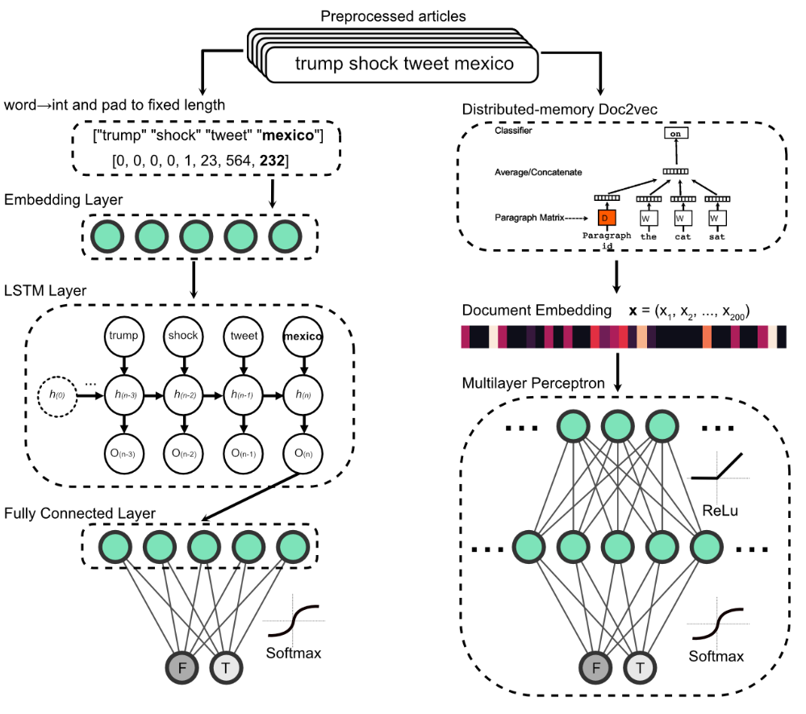

# Neuormatch NLP: Emotion and topic as diagnostic features of fake news

### Contributors: Adam Harris, Elizaveta Baranova-Parfenova, Ismalia Elimane Ly, Adrian Duszkiewicz

Here, we use sentiment analysis, topic modelling, and deep learning for investigating linguistic properties that distinguish fake news.

